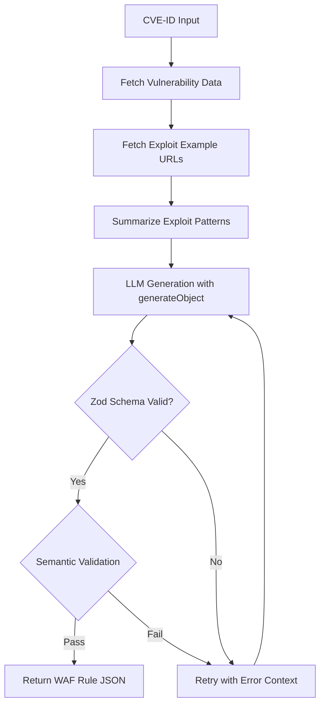

# AWS WAF Rule Generator Agent

## Architecture Overview




## Recommended Stack (Simplified)


| Component    | Choice                             | Rationale                                                                 |
| ------------ | ---------------------------------- | ------------------------------------------------------------------------- |
| Runtime      | Node.js + TypeScript               | Type safety, better DX                                                    |
| AI SDK       | **Vercel AI SDK (native)**         | `generateObject` with Zod is sufficient - no need for Mastra or LangGraph |
| Schema       | **Zod**                            | Built-in validation with Vercel AI SDK                                    |
| LLM Provider | OpenAI (default), easily swappable | Vercel AI SDK supports Anthropic, Google, etc. out of the box             |
| Testing      | Vitest                             | Fast, TypeScript-native                                                   |


**Why skip Mastra/LangGraph?** The flow is linear (fetch → generate → validate → retry). The Vercel AI SDK's `generateObject` with `maxRetries` and error handling covers this cleanly without added complexity.

## Project Structure

```
src/
├── index.ts              # CLI entry point
├── agent/
│   ├── generator.ts      # Core WAF rule generation logic
│   └── prompts.ts        # System prompts and templates
├── schemas/
│   └── waf-rule.ts       # Zod schema for AWS WAF rule format
├── db/
│   └── vulnerabilities.ts # Mock DB / data fetching
├── enrichment/
│   └── exploit-fetcher.ts # Fetch & summarize exploit example URLs
├── validation/
│   └── semantic.ts       # Semantic validation (rule logic checks)
└── utils/
    └── config.ts         # Environment config
tests/
├── generator.test.ts
└── schemas.test.ts
```

## Key Implementation Details

### 1. AWS WAF Rule Schema ([src/schemas/waf-rule.ts](src/schemas/waf-rule.ts))

Define a Zod schema matching the [AWS WAF RuleStatement](https://docs.aws.amazon.com/waf/latest/APIReference/API_RuleStatement.html) structure:

```typescript
import { z } from 'zod';

export const WafRuleSchema = z.object({
  Name: z.string().regex(/^[a-zA-Z0-9_-]+$/),
  Priority: z.number().int().min(0),
  Statement: z.object({
    ByteMatchStatement: z.object({
      SearchString: z.string(),
      FieldToMatch: z.object({
        UriPath: z.object({}).optional(),
        QueryString: z.object({}).optional(),
        Body: z.object({ OversizeHandling: z.string() }).optional(),
      }),
      TextTransformations: z.array(z.object({
        Priority: z.number(),
        Type: z.string(),
      })),
      PositionalConstraint: z.enum([
        'EXACTLY', 'STARTS_WITH', 'ENDS_WITH', 'CONTAINS', 'CONTAINS_WORD'
      ]),
    }).optional(),
    // Add other statement types: RegexMatchStatement, SqliMatchStatement, etc.
  }),
  Action: z.object({
    Block: z.object({}).optional(),
    Allow: z.object({}).optional(),
  }),
  VisibilityConfig: z.object({
    SampledRequestsEnabled: z.boolean(),
    CloudWatchMetricsEnabled: z.boolean(),
    MetricName: z.string(),
  }),
});
```

### 2. Exploit Context Fetcher ([src/enrichment/exploit-fetcher.ts](src/enrichment/exploit-fetcher.ts))

Fetch the `exploit_examples_url` articles and extract attack patterns to provide richer context for WAF rule generation:

```typescript
import { generateText } from 'ai';
import { openai } from '@ai-sdk/openai';

interface ExploitContext {
  attackPatterns: string[];      // e.g., ["POST to /_api/web/", "serialized .NET payload in body"]
  targetEndpoints: string[];     // e.g., ["/_api/web/GetFileById", "/_vti_bin/client.svc"]
  payloadSignatures: string[];   // e.g., ["__VIEWSTATE", "ObjectStateFormatter"]
  httpMethods: string[];         // e.g., ["POST", "PUT"]
}

export async function fetchExploitContext(urls: string[]): Promise<ExploitContext> {
  // Fetch article content (with timeout and error handling)
  const articles = await Promise.allSettled(
    urls.map(url => fetchWithTimeout(url, 5000))
  );
  
  const successfulContent = articles
    .filter((r): r is PromiseFulfilledResult<string> => r.status === 'fulfilled')
    .map(r => r.value)
    .join('\n\n---\n\n');

  if (!successfulContent) {
    return { attackPatterns: [], targetEndpoints: [], payloadSignatures: [], httpMethods: [] };
  }

  // Use LLM to extract structured exploit patterns
  const { text } = await generateText({
    model: openai('gpt-4o-mini'), // Use cheaper model for summarization
    system: `You are a security researcher. Extract exploit technical details from articles.
Focus on: HTTP endpoints, request patterns, payload signatures, and attack vectors.
Be concise and specific - these will be used to generate WAF rules.`,
    prompt: `Extract exploit patterns from these articles:\n\n${successfulContent}`,
  });

  return parseExploitPatterns(text);
}
```

This enrichment step is critical because:

- The CVE description is often vague (e.g., "deserialization vulnerability")
- Exploit articles contain specific endpoints, payloads, and request patterns
- More specific patterns = more accurate WAF rules

### 3. Core Generator ([src/agent/generator.ts](src/agent/generator.ts))

```typescript
import { generateObject } from 'ai';
import { openai } from '@ai-sdk/openai';
import { WafRuleSchema } from '../schemas/waf-rule';
import { fetchExploitContext } from '../enrichment/exploit-fetcher';

export async function generateWafRule(vulnerability: VulnerabilityRecord) {
  // Enrich with exploit context from articles
  const exploitContext = await fetchExploitContext(vulnerability.exploit_examples_url);
  
  const { object: wafRule } = await generateObject({
    model: openai('gpt-4o'),
    schema: WafRuleSchema,
    prompt: buildPrompt(vulnerability, exploitContext), // Include exploit patterns
    maxRetries: 3,
  });
  
  await validateRuleSemantics(wafRule, vulnerability);
  return wafRule;
}
```

### 4. Self-Correction Loop

The Vercel AI SDK's `generateObject` automatically retries on schema validation failures. For semantic validation (e.g., "does this rule actually block the exploit?"), implement a manual retry:

```typescript
async function generateWithSemanticRetry(vuln: VulnerabilityRecord, maxAttempts = 3) {
  let lastError: Error | null = null;
  
  for (let attempt = 0; attempt < maxAttempts; attempt++) {
    const rule = await generateObject({
      model: openai('gpt-4o'),
      schema: WafRuleSchema,
      prompt: attempt === 0 
        ? buildPrompt(vuln)
        : buildCorrectionPrompt(vuln, lastError),
    });
    
    const validation = await validateSemantics(rule.object);
    if (validation.valid) return rule.object;
    
    lastError = new Error(validation.errors.join(', '));
  }
  
  throw new Error(`Failed after ${maxAttempts} attempts: ${lastError}`);
}
```

### 5. Multi-Provider Support (Bonus)

Vercel AI SDK makes this trivial:

```typescript
import { openai } from '@ai-sdk/openai';
import { anthropic } from '@ai-sdk/anthropic';
import { google } from '@ai-sdk/google';

const providers = {
  openai: openai('gpt-4o'),
  anthropic: anthropic('claude-sonnet-4-20250514'),
  google: google('gemini-1.5-pro'),
};

const model = providers[process.env.LLM_PROVIDER || 'openai'];
```

## CLI Interface

```bash
# Basic usage
npx tsx src/index.ts --cve CVE-2025-53770

# With provider override
npx tsx src/index.ts --cve CVE-2025-53770 --provider anthropic

# Output to file
npx tsx src/index.ts --cve CVE-2025-53770 --output rule.json
```

## Deliverables Mapping


| Requirement        | Implementation                                           |
| ------------------ | -------------------------------------------------------- |
| Operational Guide  | `README.md` with setup + usage                           |
| Source Code        | TypeScript implementation in `src/`                      |
| Production Roadmap | `docs/PRODUCTION.md` covering scaling, monitoring, CI/CD |


## Production Roadmap Highlights

Document in `docs/PRODUCTION.md`:

1. **Deployment**: Vercel Serverless Functions or AWS Lambda
2. **Rate Limiting**: Token budget per request, queue for batch processing
3. **Monitoring**: Log all generations, track validation failure rates
4. **Security**:
  - Input sanitization (CVE-ID format validation)
  - Output filtering (no secrets in generated rules)
  - Prompt injection mitigation (structured input, no user text in prompts)
5. **Caching**: Cache generated rules by CVE-ID + model version
